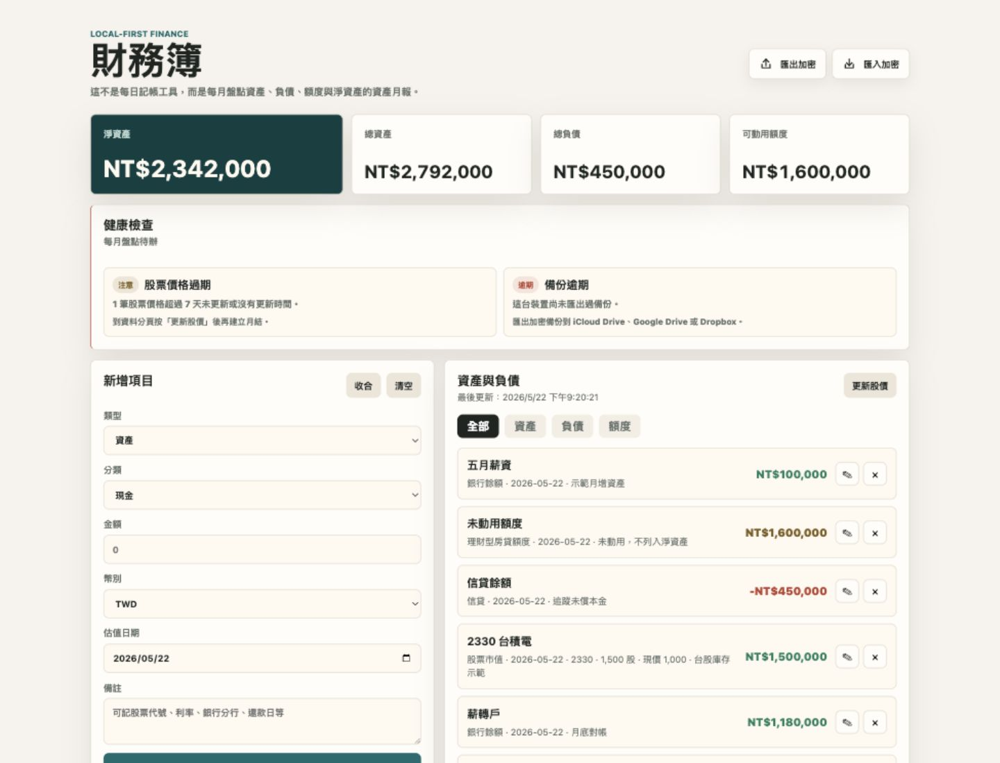
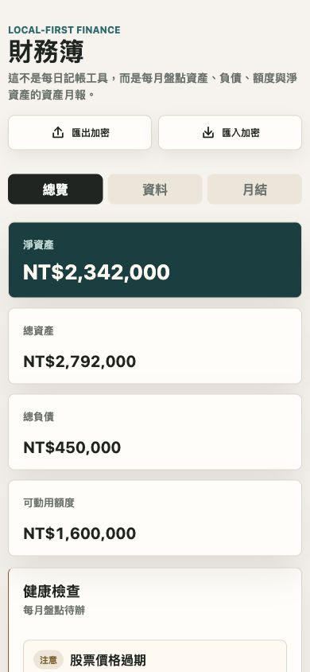
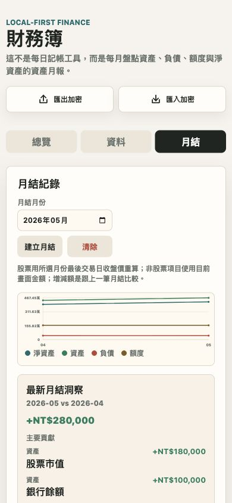

# 財務簿 / Personal Balance Sheet

本機優先的個人資產負債表 PWA，用來做每月資產、負債、額度與淨資產盤點。這不是每日記帳工具，不記早餐、交通或刷卡明細，而是幫你回答：

> 這個月我的淨資產變多還是變少？主要原因是什麼？

Local-first personal balance sheet PWA for monthly asset, liability, credit-limit, and net-worth tracking. It is not a daily expense tracker.

## Screenshots

### Desktop Overview

### iPhone Overview

### iPhone Monthly Close

## Features / 功能

- 資產、負債、可動用額度管理：現金、銀行餘額、股票市值、房地產、房貸、理財型房貸已動用、理財型房貸額度等。
- 台股市值估算：輸入股票代號與股數，連網時可抓現價並換算市值。
- 房產參考估值：房地產可連動房貸，並用實價登錄 Open Data 做行政區或同路段中位數參考估值；既有房產可更新參考估值，估值需手動套用。
- 每月月結：股票用所選月份最後交易日收盤價重算，非股票項目使用目前畫面金額。
- 趨勢圖與月結洞察：查看淨資產、資產、負債、額度趨勢，並分析最新月結相對前一筆的主要變化。
- 健康檢查：提醒資料是否太久未更新、股票價格是否過期、本月是否尚未月結、備份是否逾期。
- 加密備份：匯出 `.encrypted.json`，使用瀏覽器 Web Crypto API 加密。
- iPhone 分頁介面：手機版分成 `總覽 / 資料 / 月結`，減少長頁捲動。

## Data Privacy / 資料隱私

- 資料儲存在目前瀏覽器的 IndexedDB。
- GitHub Pages 只提供靜態檔案，沒有後端、沒有登入、沒有資料庫。
- 加密備份使用 `PBKDF2-SHA256 + AES-GCM` 在瀏覽器本機完成。
- 密碼不會存進 localStorage 或備份檔；忘記密碼就無法還原加密備份。
- 不要把備份檔 commit 到 repo，即使是加密檔也建議放在 iCloud Drive、Google Drive、Dropbox 等個人空間。

## How To Use / 每月怎麼用

1. 更新現金、銀行、貸款餘額與可動用額度。
2. 按 **更新股價**，刷新股票市值。
3. 選擇月結月份並按 **建立月結**。
4. 查看月結趨勢與最新月結洞察。
5. 匯出加密備份，保存到你自己的雲端硬碟或裝置。

## User Guide / 使用情境

### 基本資產與負債

- 現金：用 `資產 / 現金`，名稱會固定為現金。
- 銀行存款：用 `資產 / 銀行餘額`，金額填目前帳戶餘額。
- 股票：用 `資產 / 股票市值`，輸入股票代號、股數與現價；連網時可抓現價。
- 一般貸款：用 `負債 / 房貸`、`負債 / 信貸`、`負債 / 車貸` 等，金額填尚未清償的本金餘額。

### 房地產

- 房子本身用 `資產 / 房地產`。
- 建物坪數建議填房屋坪數，不含車位坪數；車位價格可寫在備註，或手動加進目前估值。
- 線上參考估值會用實價登錄 Open Data 篩選住宅交易，先取同行政區每坪中位數；若填 `路段/街道` 且同路段樣本至少 5 筆，會改用同路段每坪中位數。
- 估值結果會揭露使用層級、每坪中位數、樣本數、資料期間與信心；它不會依社區、屋齡、樓層、車位、裝潢修正，也不會自動覆蓋你的房產估值。
- 已建立的房產卡片可按 `估值` 更新系統參考值；更新後仍需進入編輯並按 `套用參考估值`，才會改變房產金額。
- 若房子還有房貸，可在 `連動房貸/已動用` 選到對應負債，房產卡片會顯示房產總值、連動負債與房產淨值。

### 理財型房貸

- 未動用的理財型房貸只是一條可借額度，用 `額度 / 理財型房貸額度`，不列入負債，也不扣淨資產。
- 已動用的金額才是負債，用 `負債 / 理財型房貸已動用`，金額填實際動用且尚未償還的本金。
- 如果已動用金額是綁在某間房子上，可以在房地產的 `連動房貸/已動用` 選這筆負債，方便看房產淨值。

### 月結與備份

- 月底或月初先更新所有餘額，再建立月結。
- 股票月結會嘗試用所選月份最後交易日收盤價重算；其他項目使用目前畫面金額。
- 建立月結後建議立刻匯出加密備份。資料只存在目前瀏覽器，換手機或清除瀏覽器資料前務必先備份。

## Deploy / Install

GitHub Pages settings:

- Source: `Deploy from a branch`
- Branch: `main`
- Folder: `/root`

部署後，用 iPhone Safari 開啟 GitHub Pages 網址，選擇 **Add to Home Screen / 加入主畫面**，就可以像 app 一樣使用。

## Tech Stack

- HTML / CSS / vanilla JavaScript
- IndexedDB
- Web Crypto API
- Service Worker + Web App Manifest
- GitHub Pages

## Roadmap

- 財務目標：目標淨資產、達標進度、依月結趨勢估算達標時間。
- 測試與 CI：補核心計算 helper 測試、GitHub Actions、簡單 E2E。
- CSV 匯入：支援銀行或證券庫存匯入。
- 多幣別：匯率更新與跨幣別淨資產估算。
